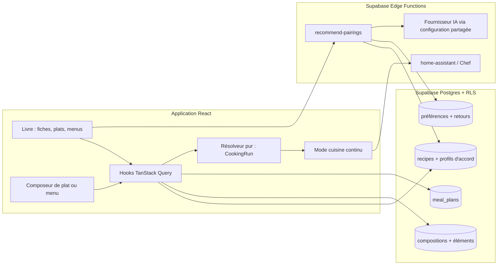
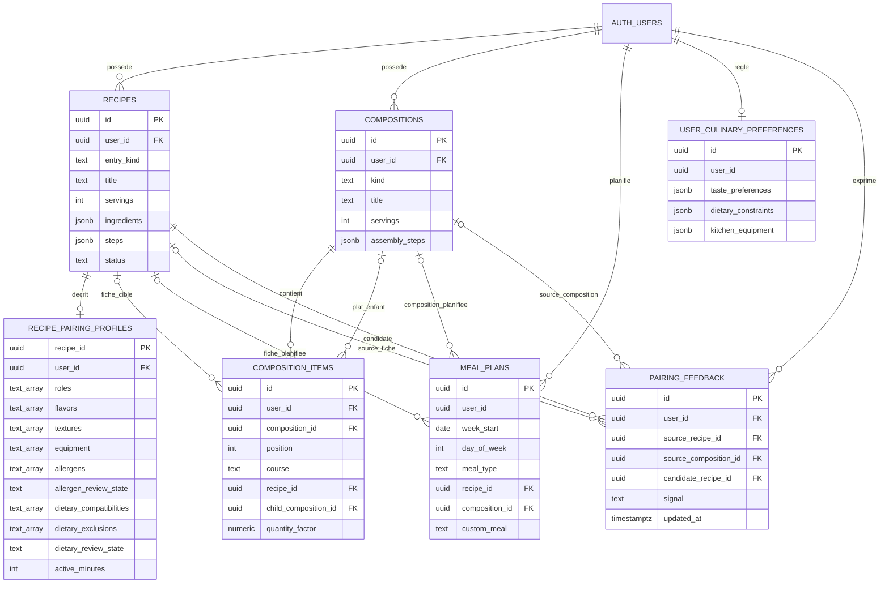
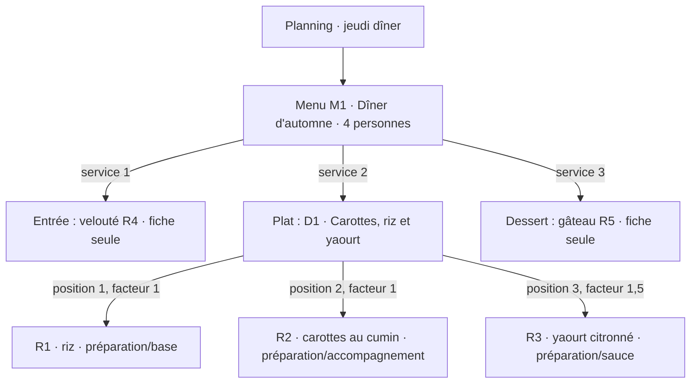
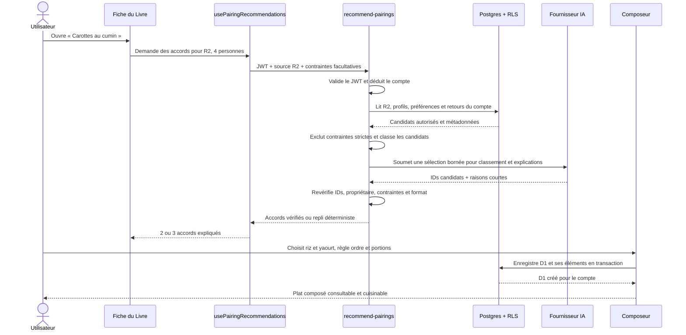
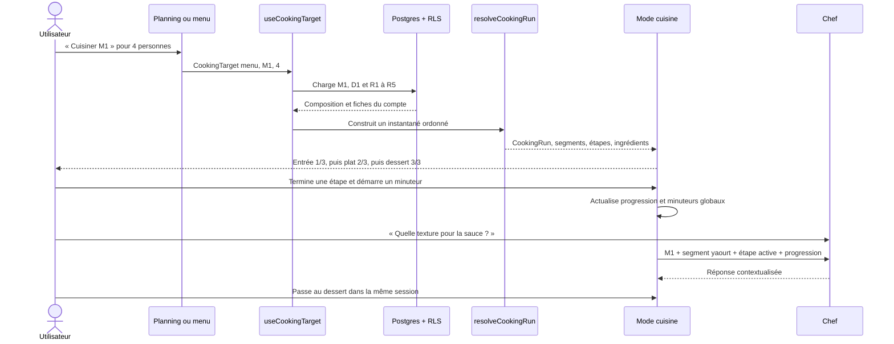
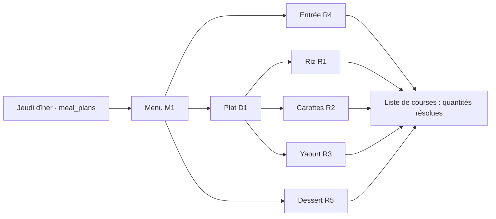

# Architecture du Livre modulaire — graphes et exemples

**Statut :** architecture proposée pour la V1, sans implémentation.

**Décisions produit validées le 2026-09-19 :** un menu se cuisine dans une session continue ; les accords de V1 sont des suggestions et des compositions enregistrées, sans lien éditorial permanent entre deux fiches.

**Plan associé :** [Livre modulaire : préparations, accompagnements, plats et menus](2026-09-17-livre-preparations-accords.md).

Les diagrammes distinguent les tables **existantes** (`recipes`, `meal_plans`, `user_culinary_preferences`) des objets **proposés** (profil d'accord, composition, éléments et retours). Les noms SQL et les contrats ci-dessous sont des cibles de conception ; aucune migration n'a été appliquée.

## 1. Vue d'ensemble : où vit chaque responsabilité ?

**Source de vérité :** les ingrédients et étapes restent dans `recipes`. Une composition stocke seulement des références, l'ordre, les coefficients et ses propres instructions de dressage. `CookingRun` est calculé à l'ouverture du mode cuisine ; il ne crée pas une nouvelle recette fusionnée.

## 2. Modèle de données

**Règles de structure :**

1. `recipes.entry_kind` vaut `preparation`, `complete_dish` ou `NULL` pour une recette historique « À classer ». « Accompagnement » est un rôle du profil d'une préparation, pas un troisième type exclusif. Le profil d'accord facultatif contient les métadonnées révisables, dont allergènes, compatibilités et exclusions alimentaires dans une taxonomie commune aux régimes et restrictions de l'utilisateur, avec un état de revue distinct. Un profil ou un état de revue absent reste inconnu et exclut la fiche des suggestions soumises à une contrainte stricte.
2. `compositions.kind` vaut `dish` ou `menu`. Chaque `composition_item` référence **exactement une** fiche (`recipe_id`) **ou** un plat composé (`child_composition_id`). Un `dish` accepte seulement des fiches ; un `menu` accepte des fiches ou des `dish`. Aucun menu enfant n'est accepté. `position` est unique dans sa composition, `quantity_factor` est positif, et `course` nomme le service du menu ; `position` en fixe l'ordre. La règle entre `kind` du parent et de l'enfant nécessite une validation transactionnelle côté base, car un simple `CHECK` ne lit pas une autre ligne.
3. `composition_items.user_id` reprend le propriétaire du parent. Toutes les références entre objets privés utilisent des clés étrangères composites comprenant `user_id`, avec les contraintes `UNIQUE (user_id, id)` correspondantes sur les cibles : éléments vers composition, fiche ou plat enfant, profil vers fiche, planning vers cible et retours vers source/candidate. Elles empêchent une référence vers un autre compte, même si une requête applicative est erronée. RLS vérifie aussi `auth.uid() = user_id` en lecture et en écriture, avec `USING` et `WITH CHECK` selon l'opération ; indexer les clés de jointure, les références et les colonnes utilisées par RLS. Les contraintes de type parent/enfant sont vérifiées côté base, en plus de la validation des formulaires.
4. Après audit des lignes existantes, un créneau `meal_plans` référence exactement une cible : `recipe_id`, `composition_id` ou `custom_meal`. Les anciens `recipe_id` restent valides. Une composition peut être planifiée plusieurs fois sans copier ses éléments.
5. `pairing_feedback` mémorise l'état personnel courant (pertinent, pas pour moi, masquer), la fiche candidate et une source : `source_recipe_id` **ou** `source_composition_id`, exactement une des deux. Deux index uniques partiels, `(user_id, source_recipe_id, candidate_recipe_id)` lorsque la source est une fiche et `(user_id, source_composition_id, candidate_recipe_id)` lorsqu'elle est une composition, permettent un upsert sans signaux contradictoires. Les références restent limitées au même compte. Cette table ne représente pas un accord éditorial permanent. Aucune table de « couples recommandés » n'est nécessaire en V1.
6. Les suppressions suivent une règle explicite. `composition_items.composition_id` est en `ON DELETE CASCADE`, car les éléments appartiennent à leur composition. `composition_items.recipe_id`, `composition_items.child_composition_id` et les cibles de `meal_plans` sont en `RESTRICT` : la base refuse la suppression définitive d'une cible encore utilisée et l'interface indique les compositions ou créneaux à corriger. Le profil d'accord cascade avec sa fiche ; les retours cascade lorsque leur source ou candidate est supprimée, après levée des références restrictives. L'audit de migration remplace donc le `ON DELETE SET NULL` actuel de `meal_plans.recipe_id` afin de préserver la contrainte d'une cible exactement.

### Graphe d'instances fictives

`M1` et `D1` gardent les identifiants de `R1` à `R5`. Modifier la fiche `R2` mettra sa prochaine ouverture à jour dans `D1` et `M1`. Les étapes déjà chargées dans une session de cuisine en cours restent figées.

## 3. Interactions : suggérer, choisir, enregistrer

**Exemple de décision :** « Le yaourt citronné apporte de l'acidité aux carottes ; le riz apporte une base douce. » Si la fiche du yaourt n'a pas été revue pour une allergie déclarée, elle quitte la liste automatique jusqu'à vérification. L'IA reçoit un nombre limité de candidats existants et ne peut pas créer de référence vers une recette inventée. En cas d'indisponibilité de l'IA, le classement déterministe fournit les mêmes actions de sélection manuelle.

La fonction Edge a `verify_jwt = true`, n'accepte pas de `user_id` d'autorité dans la requête et utilise un client Supabase au nom de l'utilisateur afin que la RLS reste effective. Un client service role éventuel est réservé à la configuration interne qui l'exige, avec chaque lecture filtrée par l'identifiant authentifié. Les allergies, ingrédients refusés, textes complets et identifiants personnels servent au filtrage local mais ne sont pas envoyés au fournisseur IA ; celui-ci reçoit uniquement les métadonnées culinaires minimales des candidats déjà autorisés, indexées par des jetons opaques temporaires. La correspondance jeton-UUID reste côté serveur et la réponse du modèle est remappée puis validée avant exposition au client. Un éventuel cache est cloisonné par utilisateur et invalidé avec les versions de la source, des candidats et des préférences.

L'enregistrement de `D1` doit être atomique : validation du propriétaire, du type de chaque élément, des positions et des coefficients, puis insertion de la composition et de ses éléments dans une transaction côté base (par exemple une RPC `SECURITY INVOKER` soumise aux politiques RLS, avec `search_path` fixé et noms de schéma explicites). L'interface passe par un hook TanStack Query et invalide ensuite les listes concernées.

## 4. Interactions : construire et parcourir la session continue

`resolveCookingRun` est une fonction pure testable. Elle parcourt `menu → plat composé → fiches`, applique les portions, puis construit des segments de service et une liste linéaire d'étapes. Une clé d'étape inclut le chemin de l'élément, par exemple `M1/service2/D1/item3/R3/step1` : si la même recette apparaît deux fois, sa progression et ses minuteurs restent distincts. Les minuteurs déjà lancés restent visibles lors du passage à la fiche suivante.

### Exemple de quantités et de concaténation

| Fiche | Rendement de la fiche | Quantité source | Facteur dans D1 | Quantité pour 4 |
| --- | ---: | --- | ---: | --- |
| R1 Riz | 4 portions | 200 g de riz | 1 | 200 g |
| R2 Carottes | 4 portions | 600 g de carottes | 1 | 600 g |
| R3 Yaourt citronné | 2 portions | 100 g de yaourt | 1,5 | 300 g |
| R4 Velouté, entrée | 4 portions | 200 g de carottes | 1 | 200 g |
| R5 Gâteau, dessert | 8 portions | ingrédients pour 8 | 1 | moitié des quantités |

Pour `R3` : `100 g × (4 ÷ 2) × 1,5 = 300 g`. La liste globale peut afficher **800 g de carottes** si R2 et R4 utilisent bien le même nom normalisé et la même unité. Elle conserve **300 g de yaourt** et **200 g de riz**. Des libellés ou unités incompatibles restent séparés avec leur fiche d'origine.

| Ordre affiché dans un seul `CookingRun` | Source | Navigation |
| --- | --- | --- |
| Entrée · préparer le velouté | R4 | Étapes de R4 |
| Plat · cuire le riz | D1 → R1 | Étapes de R1 |
| Plat · rôtir les carottes | D1 → R2 | Étapes de R2 ; minuteur toujours visible ensuite |
| Plat · mélanger le yaourt citronné | D1 → R3 | Étapes de R3 |
| Plat · dresser l'assiette | D1 | Instruction d'assemblage validée à l'édition |
| Dessert · préparer le gâteau | R5 | Étapes de R5, puis fin de la session |

La V1 concatène les étapes dans cet ordre explicite. Elle affiche les repères de service et permet de sauter à un segment tout en gardant une progression globale. Une planification automatique des tâches parallèles entre fiches serait une évolution distincte ; les `parallel_with` existants restent locaux à leur recette.

## 5. Planning, courses et limites de la V1

Le planning garde **une ligne par créneau** et pointe vers `M1` ; la liste de courses déplie chaque référence une fois par occurrence réellement planifiée, avec ses portions. Un même menu placé deux soirs compte donc deux fois. La session de cuisine reste un objet d'exécution calculé à l'ouverture, distinct du menu enregistré ; la reprise après fermeture de l'application n'est pas spécifiée dans cette V1 et doit être décidée avant d'implémenter un stockage de progression.

## Points à valider lors de l'implémentation

- Vérifier les migrations et les politiques RLS avec deux comptes, y compris une tentative de référence croisée et une suppression d'une fiche utilisée dans un plat.
- Vérifier un menu contenant deux fois la même fiche, un plat modifié après enregistrement du menu, des portions manquantes et des unités d'ingrédients incompatibles.
- Vérifier le repli sans IA, les exclusions alimentaires et l'absence de référence inventée dans la réponse du moteur.
- Vérifier les parcours `recipe`, `dish`, `menu` sur mobile, la progression continue, les minuteurs et le contexte transmis à Chef.
